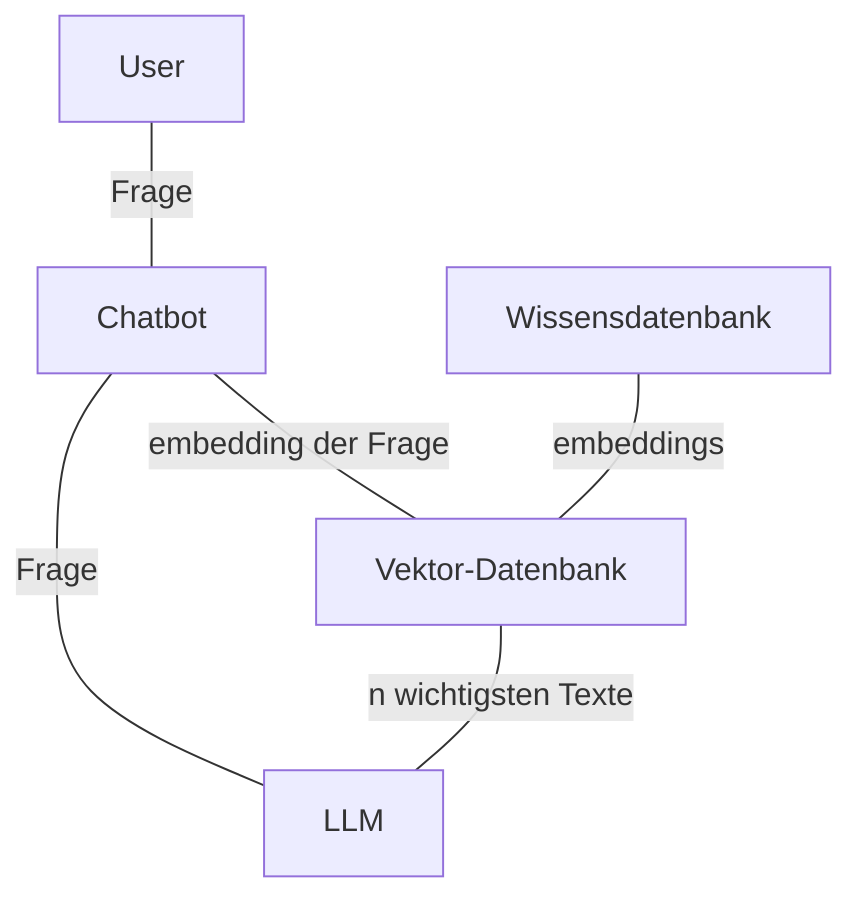

# NBA Fantasy League Recommender

## TODOS

- Huggingface zum Modell verwenden

- Darstellung
    - Backend: Flask
    - Frontend: Streamlit
    - Macht **Stamm**
- [ ] Pipeline Designen
    - Pipeline basteln **BigM**
    - Webscraping **BigM**
- [ ] Modelle finden
    - LLAMA (ist gut) **Stamm**
    - Mistral / Mixtral (ist schlecht) **Luis**
    - **Bunge** hat nen Vogel (Bird)
    - [Liste an ideen](https://www.datacamp.com/blog/top-open-source-llms)
    - [Liste an ideen](https://github.com/eugeneyan/open-llms)
- [ ] Bewertungsmetriken festlegen 
    - TODO **JB**
- [ ] Doku
    - **JB**

Next meeting next Wednesday vor dem dings 11:30h
 
## Initiale Idee

### Ziel:

Entwicklung einer Plattform, die NBA-Fantasy-Spielern datenbasierte Empfehlungen liefert, basierend auf aktueller Spieler-Performance und relevanten Berichten, mithilfe von Webscraping und LLMs.

### Probleme:

Informationsüberflutung durch zahlreiche News und Statistiken.
Schwierige Analyse dynamischer Spielerleistungen.
Unsicherheiten durch Verletzungen, Trade-Gerüchte und Formänderungen.
Lösung:

**Datenaggregation**: Webscraping von Spielerstatistiken und relevanten News.
NLP mit LLMs: Analyse und Bewertung von Berichten (z. B. Verletzungen, Trends).
**Empfehlungssystem**: Datenbasierte Vorschläge für Spieleraufstellungen, Trades und Investitionen.
**Methoden**:

Webscraping & APIs.
Statistische Analysen und ML-Modelle für Performance-Vorhersagen.

### Ergebnis:

Eine benutzerfreundliche Plattform, die fundierte, automatisierte Empfehlungen für Fantasy-Ligen bereitstellt, um Nutzern einen strategischen Vorteil zu verschaffen.

# Meeting 1

_Modelle_

- Problem: LLama ist viel zu langsam
- BERD kann nur Lücken füllen
- Gema ist gut (Output länge 120 Tokens)

_Webscraping:

- Artikel werden zu lang sein
- Vektor-Embeddings @Luis hat evtl schon code-snippits
    - Ziel: sentiment analysis
    - Welche information: wie bewerten Artikel performance von spielern fürs nächste Spiel
    

_Neue Idee Webscraping_

Am Anfang Webscraping zu Spielerperformance in kommenden spielen (Artikel dazu) in ne Wissensdatenbank füllen

Metriken:
- Informationsextraktion named-entity-recognition, aug-roc-kurve, klassicshe metriken (F1, accuracy)
- Sentiment analysis: (modell bewertung vs tatsächliches outcome)
- scoring der zusammenfassungen (GLU-score)

_Applikation_
- Front und Backend sind schon in groben zügen fertig
- Matcher finded Teams und Personen

## PLAN

3 Teams:

1) V1 fertig stellen:  (Lukasse)
    - Modelle aus Colab ins Git ziehen
2) Webscraping (Martin und Luis)
    - fertig machen
    - V2 vorbereiten
3) Evaluierung (Joel)
    - Bekommen der Daten?

V1 und V2

### V1:

- Einfache architektur: aktuell funktionierende Systeme zusammenziehen
- Webscraping-Kontext als Text direkt in die Anfrage
- Webscraping bei jeder anfrage
- Nur 5 Artikel webscraping

### V2:

- Embeddings als Kontext fürs LLM
- 1 mal am Tag Wissensdatenbank aufbauen

**Endabgabe am 20.1.** (Sind knapp 2 Wochen)

Next meet 1. Woche 
