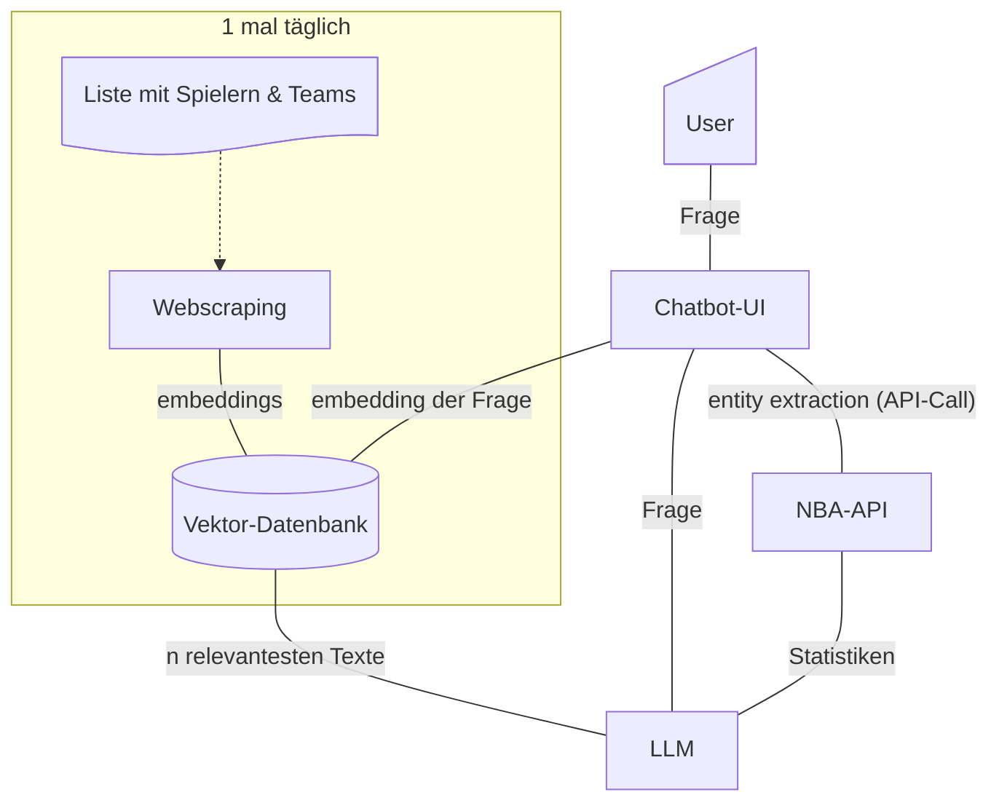
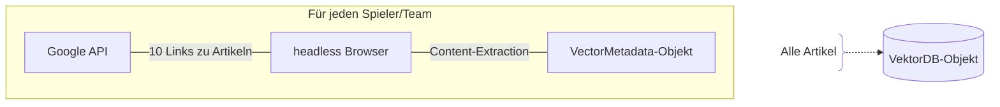
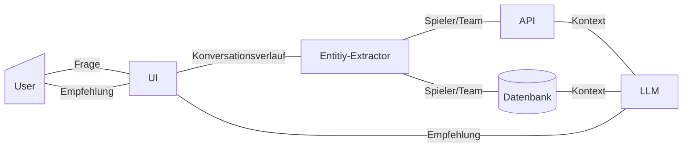

# Team

__Kurs__: WWI22DSA

|Name|Matrikelnummer|
|-|-|
|Joel Bück|4860895|
|Luis Litters|4512765|
|Lukas Runge|7590014|
|Lukas Stamm|8402366|
|Martin Schauer|7961802|

# Projekt

## Ziel

Entwicklung einer Plattform, die [NBA-Fantasy](https://de.nbafantasy.nba.com/)-Spielern datenbasierte Empfehlungen liefert, basierend auf aktueller Spieler-Performance und relevanten Berichten, mithilfe von Webscraping und LLMs.

## Probleme

Informationsüberflutung durch zahlreiche News und Statistiken. Schwierige Analyse dynamischer Spielerleistungen. Unsicherheiten durch Verletzungen, Trade-Gerüchte und Formänderungen. Lösung:

__Datenaggregation__: Webscraping von Spielerstatistiken und relevanten News. 

__NLP mit LLMs__: Analyse und Bewertung von Berichten (z. B. Verletzungen, Trends).

__Empfehlungssystem__: Datenbasierte Vorschläge für Spieleraufstellungen, Trades und Investitionen für Fantasy League. 

__Methoden__: Mithilfe von Webscraping werden Informationen zur Performance der Spieler gesucht, die sich aus den Daten, die eine NBA-API zur verfügung stellt, nicht abbilden.

## Ergebnis

Ein Chatbot, der über Spieler und Teams der NBA gefragt werden kann, um empfehlungen für Fantasy League zu geben. Dazu werden aktuelle Artikel und die Spielerstatistiken, die die NBA bereitstellt, als Entscheidungsgrundlage zuhilfe gezogen.

# Code

Main Entry-Point: [app.py](app.py)

Interaktion mit der App über den localhost.

## Struktur

project

├── etc

│   └── .env

├── vector_storage

│   ├── timestamp.txt

│   └── vectorstrore.pkl

├── utility

│   ├── EntityExtractor.py

│   ├── entity_list.txt

│   ├── helper_functions.py

│   ├── nba_data.py

│   ├── variables.py

│   ├── vector_db.py

│   └── web_scraper.py

├── app.py

└── backend.py

### vector_storage

Der Ordner vector_sorage wird beim Ausführen des Codes automatisch erstellt. Hier wird die Vektordatenbank persistent gespeichert, um nur 1 mal am Tag webscrapen zu müssen (Tokens sparen).

### /etc

Der Ordner etc muss selbst erstellt werden. Dort muss ein File ".env" abgelet werden, der folgende VAriablen definiert:

|Variable|Wert|
|-|-|
|GOOGLE_KEY|Account-key für die Google programmable search engine REST-API|
|GOOGLE_ID|[ID der Search Engine](https://programmablesearchengine.google.com/controlpanel/all)|
|HUGGINGFACE_LOGIN|Login-Token für Huggingface|

> [!NOTE]
> Die kostenlose API von Google unterstützt nur 100 Suchen pro Tag!

## User Interface


Das UI ist schlicht und ähnelt dem, der ChatGPT-Onlineanwendung. 

Die App wird mit Streamlit und Flask umgesetzt. Streamlit erstellt die UI und Flask handled das Backend.

## VektorDB



### [Webscraper](utility/web_scraper.py)

Enthält eine Funktion ```recieve_vector_store()```, die das Webscrapen und die Vektordatenbank managed:

- Es wird überprüft, ob eine aktuelle Datenbank vorliegt (gespeichert ist)
- Wenn ja, wird diese als ```VectorDB```-Objekt zurückgegeben
- Wenn nein, wird ein Webscraping durchgeführt, eine neue ```VectorDB``` erstellt, gespeichert und zurückgegeben.

Ablauf des Webscrapings:



### [Vektordatenbank](utility/vector_db.py)

Das ```VectorDB```-Objekt hat eine Methode ```similarity_search(query:str)```, die eine Liste der top n ähnlichen Texte zurück gibt.

Es wurde eine Klasse ```VectorMetadata``` implementiert, die das Interface eines Dictionaries nutzt und das Format der Daten für das Erstellen der Datenbank sicherstellt.

## [LLM](backend.py)

Die Einbindung des LLMs geschieht mithilfe von Ollama

Ablauf des Generierens von Recommendations:


